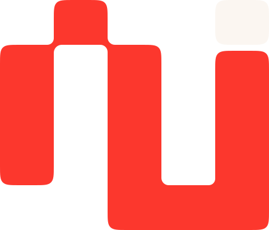
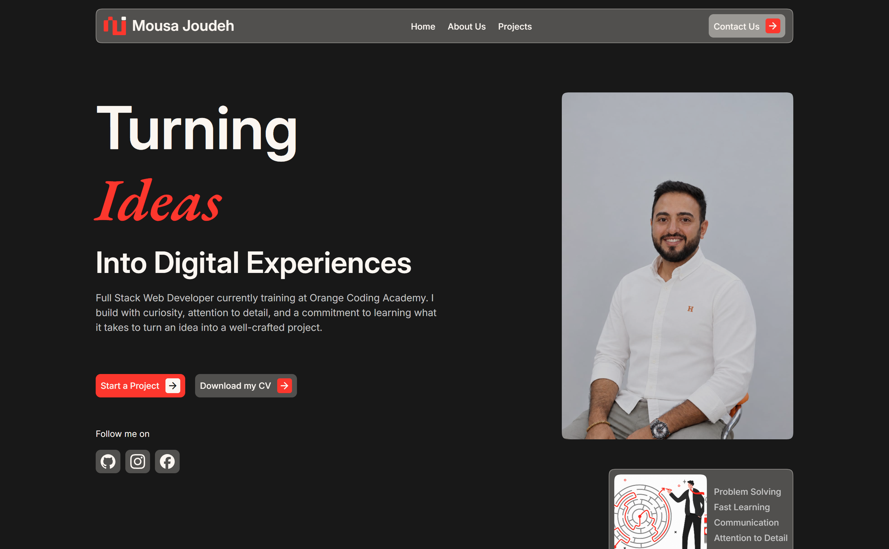

<br />
<div align="center">
    
    <br />
    <br />
    <p>
        Personal Portfoloi Website HTML | CSS | Bootstrap.
</p>

</div>

<br />



## 🗒️ Table of Contents

1. [💬 Introduction](#introduction)
2. [🛠️ Tools](#tools)
3. [✨ Features](#features)
4. [🚀 Getting Started](#getting-started)

## <a name="introduction">💬 Introduction</a>

This project is a personal portfolio website created to showcase my skills, projects, and professional background as a web developer.

The website is designed with a clean, modern, and responsive layout to provide a smooth user experience across different devices and screen sizes. It was developed using HTML, CSS, and Bootstrap, with a focus on practicing front-end development and creating a professional online presence.

## <a name="tools">🛠️ Tools</a>

- HTML
- CSS
- Bootstrap

## <a name="features">✨ Features</a>

- **Responsive Design:** Ensures portfolio looks great on desktops, tablets, and mobile devices.
- **Clean and Modern Layout:** A professional design that highlights projects, skills, and contact.

## <a name="getting-started">🚀 Getting Started</a>

To get started follow these steps:

#### Cloning the Repository

Using CLI

```bash
git clone https://github.com/Mousa-Joudeh/portfolio-website.git
```

**\*\*_Ensure you have installed [Git](https://git-scm.com) on your machine._**

or using GitHub:

- Go to the project [repository](https://github.com/Mousa-Joudeh/portfolio-website) on my GitHub page
- Click on the green button on the top 👆
- Click Download ZIP
